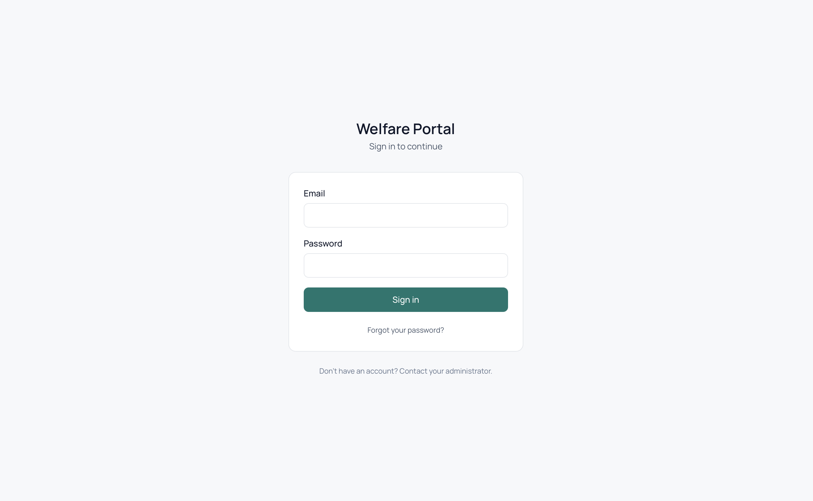
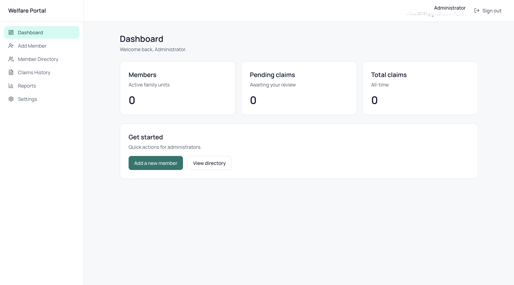
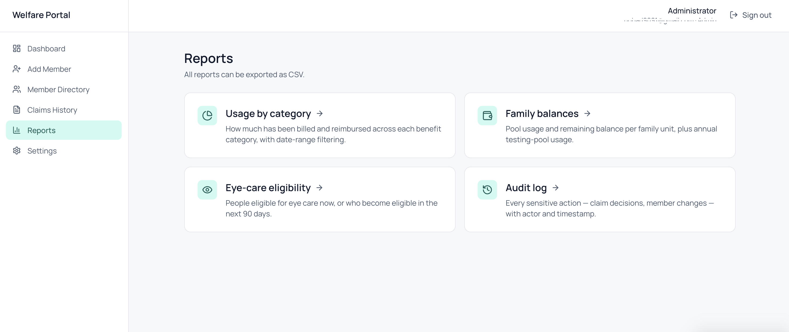
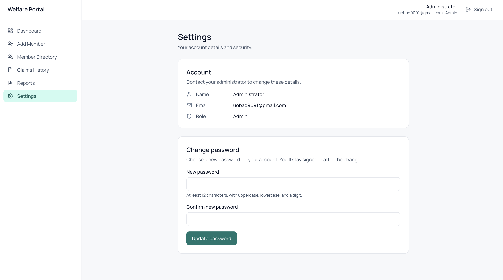

<div align="center">

# 🏥 Welfare Benefits Portal

### _A production-grade medical & welfare benefits management system for committee-based welfare schemes._

[](https://nextjs.org/)
[](https://www.typescriptlang.org/)
[](https://supabase.com/)
[](https://tailwindcss.com/)
[](https://netlify.com/)
[]()

</br>

**Replacing spreadsheets, paper forms, and manual approvals with a secure, auditable, self-service portal.**

[**🌐 Go Live**](https://uobad9091-welfare.netlify.app)

</div>

---

## 📖 What this project does

> _Imagine a workplace welfare committee that gives every member's family a **LKR 500,000 medical safety net** - covering hospital bills, eye care, and lab testing._

For years, this was managed on paper and spreadsheets. Wrong calculations, lost receipts, no audit trail, and the treasurer spending evenings doing math no human should do.

**This portal replaces all of that.** Members log in, submit a medical bill with a photo of the receipt, and the system instantly tells them - and the admin - exactly how much will be reimbursed and why. Every decision is logged. Every cent is tracked. Nothing gets lost.

### 👥 Who uses it?

| Role | What they do |
|---|---|
| 👨‍👩‍👧 **Committee members** | Enroll their family, submit claims with bill scans, see their family's remaining balance in real time |
| 👨‍💼 **Administrators** | Review pending claims, approve/reject with notes, run reports, manage member enrollment |
| 🔒 **The system itself** | Enforces the rules, prevents over-claims, keeps an immutable audit log of every action |

---

## ✨ Engineering highlights

This is more than a CRUD app. A few things I'm particularly proud of:

🧠 &nbsp;**Pure-function eligibility engine** - Every benefit rule (4 categories, family-pool caps, cooldown periods, coinsurance tiers) lives in a single tested module with zero I/O. Easy to reason about, easy to change when the rules change.

🛡️ &nbsp;**Defence-in-depth security** - Row-level security policies in Postgres mean that even if the application layer were bypassed, a member physically _cannot_ read another family's data. JWTs are cryptographically verified - never trusted from cookies alone.

💰 &nbsp;**Integer-cent money** - All monetary values stored as `INTEGER` cents (LKR 500,000 → `50000000`). No floating-point rounding bugs, ever. A small thing that matters enormously in a system handling real money.

📜 &nbsp;**Append-only audit log** - Every approval, rejection, reversal, member creation, and admin action is written to an immutable log table. The treasurer can answer _"who approved this and when?"_ for any record, forever.

🎯 &nbsp;**Server-only secrets, by construction** - The `server-only` and `client-only` npm packages mean a misplaced import at any point in the codebase fails the build, not in production. Cheap insurance against catastrophic key leaks.

🧪 &nbsp;**Re-verified at approval time** - Eligibility is computed at claim submission _and_ recomputed at the moment of approval. A claim that became stale (e.g. the family pool was used up by an earlier approval) cannot be approved silently.

---

## 📸 A Glimpse Inside

<div align="center">

| Login Page | Dash Board |
|:---:|:---:|
|  |  |
| **Add member** | **Claims History** |
|  |  |
| **Reports** | **Settings** |
|  |  |

</div>

---

## 🛠️ Tech stack

<div align="center">

| Layer | Choice | Why |
|---|---|---|
| **Framework** | Next.js 16 (App Router) | Server components + server actions = no separate API layer to maintain |
| **Language** | TypeScript (strict mode) | Catches bugs at edit-time; non-negotiable for money-handling code |
| **Database** | PostgreSQL (via Supabase) | Real relational integrity, native row-level security, JSONB for audit details |
| **Auth** | Supabase Auth | Email/password + magic-link invites + email confirmation flows out of the box |
| **Storage** | Supabase Storage (private buckets) | Encrypted bill-scan storage with signed URLs only accessible to the owning family |
| **Validation** | Zod | Runtime validation of every server-action input - types and runtime checks from one schema |
| **Styling** | Tailwind CSS v4 | Calm slate + single teal accent. No purple gradients. Designed for trust, not flash. |
| **Hosting** | Netlify | First-class Next.js plugin, automatic preview deploys per branch |

</div>

---

## 🏗️ Architecture at a glance

```
                    ┌──────────────────────────────────┐
                    │     User's browser (React 19)    │
                    │   - Server components for reads  │
                    │   - Server actions for writes    │
                    └──────────────┬───────────────────┘
                                   │  HTTPS only
                                   ▼
                    ┌──────────────────────────────────┐
                    │  Next.js 16 on Netlify Edge      │
                    │  - proxy.ts: JWT auth guard      │
                    │  - Security headers              │
                    │  - Eligibility engine (server)   │
                    └──────────────┬───────────────────┘
                                   │  Postgres protocol
                                   ▼
              ┌──────────────────────────────────────────┐
              │   Supabase (Postgres + Auth + Storage)   │
              │                                          │
              │   ┌────────────────────────────────┐     │
              │   │  Row-Level Security policies   │     │
              │   │  enforce family boundaries     │     │
              │   │  at the database layer         │     │
              │   └────────────────────────────────┘     │
              │                                          │
              │   profiles · family_units · persons      │
              │   claims · claim_documents · audit_log   │
              └──────────────────────────────────────────┘
```

### 🔁 The claim lifecycle

```
draft ──▶ pending ──▶ approved ──▶ (sometimes) reversed
                 └─▶ rejected
```

Approved and rejected claims are **immutable**. Mistakes are corrected by creating a reversal record - the original stays in the audit trail, untouched.

---

## 🎯 Features

### For committee members
- 📝 **Submit claims in under a minute** - pick category, person, date, amount, attach a photo of the bill
- 💡 **See the reimbursement before submitting** - the engine tells you _exactly_ how much you'll get back and why
- 👀 **Track your family's remaining balance** at all times
- 🔐 **Set your own password** via emailed invite (admins never see or set member passwords)

### For administrators
- ✅ **Review queue** - every pending claim in one place, sorted by submission date
- ✏️ **Override with notes** - approve a different amount with a documented reason when needed
- 👨‍👩‍👧‍👦 **Family-unit enrollment** - add a committee member, their spouse, and children in one flow
- 📊 **Four CSV-exportable reports:**
  - **Family Balances** - who has used what, with visual warning bars at 90% utilisation
  - **Eye-Care Eligibility** - who can claim now and who unlocks in the next 90 days (great for proactive outreach)
  - **Usage by Category** - spending breakdown across the four benefit categories
  - **Audit Log** - every action by every user, filterable and exportable
- 🔄 **Reverse a mistaken approval** - never edit, always reverse - preserving the historical record

### Built into the rules engine

<div align="center">

| Category | The rule it enforces |
|---|---|
| 🏨 Hospital - Private | 25% of bill, _or_ the full LKR 500,000 family limit if the bill ≥ LKR 1,000,000 |
| 🏥 Hospital - Government | LKR 2,500 per day, capped at 25 days |
| 👓 Eye care | Up to LKR 15,000 per person, once every 3 years - member & spouse only |
| 🧪 Medical testing | First LKR 10,000 in full, next LKR 15,000 at 50%, annual cap LKR 17,500 |

</div>

A shared **LKR 500,000 family lifetime pool** governs hospital and eye-care claims. Testing has a separate annual allowance that resets each January. The engine knows all of this - humans don't have to.

---

## 🔒 Security & compliance

This system handles personally-identifiable information (names, NICs, medical events) and money. Security is treated as a first-class concern, not an afterthought.

| Threat | Mitigation |
|---|---|
| 🛂 Cross-family data access | PostgreSQL Row-Level Security on every table, enforced at the database |
| 🍪 Session hijacking | HttpOnly cookies + HSTS with `preload` directive |
| 🪞 Clickjacking | `X-Frame-Options: DENY` on every response |
| 🔍 MIME sniffing | `X-Content-Type-Options: nosniff` |
| 📡 Referrer leakage | `Referrer-Policy: strict-origin-when-cross-origin` |
| 🎤 Hostile browser APIs | `Permissions-Policy` blocks camera, microphone, geolocation |
| 🎭 Spoofed JWTs | `getClaims()` cryptographically verifies; cookies are never trusted directly |
| 🔑 Server-secret leakage | `server-only` package fails the build if a secret is imported into client code |
| 🤖 Search indexing | `noindex, nofollow` on every page |
| 📁 Bill-scan privacy | Storage bucket is private; access only via short-lived signed URLs |

Every sensitive action - approval, rejection, reversal, member creation, role change - is written to an **immutable audit log** with actor, timestamp, IP, and structured before/after details.

---

## 📁 Project structure

```
welfare-app/
├── src/
│   ├── app/
│   │   ├── (app)/              # Authenticated routes (sidebar layout)
│   │   │   ├── dashboard/      # Personal overview
│   │   │   ├── members/        # Member directory + enrollment
│   │   │   ├── claims/         # Submit, review, decide on claims
│   │   │   ├── reports/        # Balances · eye-care · usage · audit
│   │   │   └── settings/       # User profile management
│   │   ├── auth/               # Email confirmation + password setup
│   │   ├── login/              # Public sign-in page
│   │   └── forgot-password/    # Password reset flow
│   ├── components/
│   │   ├── layout/             # Sidebar, topbar
│   │   └── ui/                 # Button, Input, Card, Toast, Label
│   ├── lib/
│   │   ├── actions/            # Server actions (claims, members)
│   │   ├── audit/              # Append-only audit logging
│   │   ├── eligibility/        # The rules engine (+ tests)
│   │   ├── reports/            # Report queries + CSV serialisation
│   │   ├── supabase/           # Browser / server / admin clients
│   │   └── validation/         # Zod schemas
│   └── proxy.ts                # Next 16 middleware: JWT auth guard
├── supabase/
│   └── migrations/             # Versioned SQL: schema, RLS, storage, views
└── docs/                       # Architecture, deployment, handover docs
```

---

## 🚀 Running locally

> Full step-by-step setup is in [`docs/DEPLOYMENT.md`](./docs/DEPLOYMENT.md). Quick version:

```bash
# 1. Install dependencies
npm install

# 2. Set up your environment
cp .env.local.example .env.local
# → Fill in your Supabase URL and keys

# 3. Apply database migrations in the Supabase SQL editor
#    (files in supabase/migrations/, run them in numeric order)

# 4. Run the dev server
npm run dev
```

Open <http://localhost:3000>, sign in with a Supabase user you created in the dashboard, and you're in.

### Useful scripts

```bash
npm run dev          # Start development server
npm run build        # Production build
npm run lint         # ESLint
npm run type-check   # TypeScript without emitting
npm run test         # Run the eligibility-engine test suite
```

---

## 🌱 What I learned building this

- **Money is integers.** Cents-as-INTEGER avoids an entire category of subtle bugs you'd otherwise discover during a difficult conversation with a treasurer.
- **Pure functions are a gift.** The eligibility engine takes a request + history and returns a decision. No database calls, no clock, no globals. Tests are trivial; reasoning is trivial; changes are trivial.
- **Immutability changes how you think.** Once we made approved claims immutable and introduced reversal as a first-class action, "what really happened?" became a query, not a guess.
- **RLS is harder than it looks, and worth it.** Getting `SELECT` policies right with no recursion and good query plans took real care. Now the database itself enforces what the application _claims_ to enforce.
- **Documentation is the deliverable.** A non-technical administrator who can run the system on their own is worth more than another feature.

---

## 🤝 Acknowledgements

Built for a private client. The repository is shared as a portfolio piece, with all client-specific details and data redacted.

---

<div align="center">

### 💼 Looking for a developer who builds production systems, not just demos?

**Let's talk.** &nbsp; → &nbsp; [LinkedIn](https://www.linkedin.com/in/kavindu-mihiranga-35a28a276?utm_source=share&utm_campaign=share_via&utm_content=profile&utm_medium=ios_app) &nbsp;·&nbsp; [Email](mailto:your.wwkavindumihiranga@gmail.com) &nbsp;·&nbsp; [Portfolio](https://www.kavindumihiranga.com)

<sub>Made with ☕ and a healthy respect for production data.</sub>

</div>
